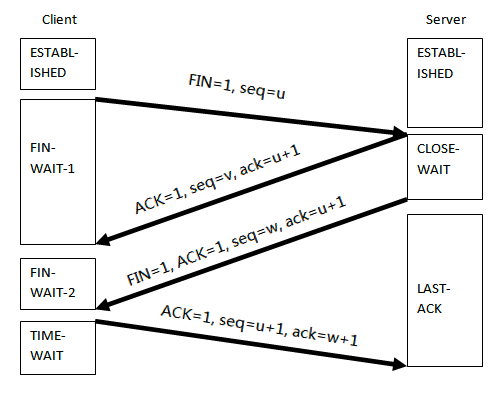

## 4-way-handshake

4-way handshake는 TCP 연결 종료 과정에서 발생합니다. 이 과정에 대해 살펴보겠습니다. 

> 이미지를 클릭하면 출처를 보실 수 있습니다.

    

## 1. 과정

연결을 끊을 주체가 데이터 전송을 마쳤더라도 서버측에서 아직 보낼 데이터가 남아있을 수 있습니다. 따라서 FIN에 대한 ACK만 보내고 데이터를 모두 전송한 후 자신도 FIN 메시지를 보냅니다.

> FIN은 TCP (Transmission Control Protocol)에서 연결 종료를 나타내는 플래그(Flag)입니다. TCP 헤더의 플래그 필드 중 하나로 사용되며 `Finish`의 약자로, TCP 연결 종료를 요청하는 신호입니다. 한 쪽이 연결을 종료하려고 할 때 해당 쪽은 FIN 패킷을 상대방에게 보내며, 이를 통해 상대방에게 연결 종료를 알리고 자신의 데이터 전송이 모두 완료되었음을 나타냅니다.

      

### 1-1. 클라이언트가 연결 종료 요청을 보냄

클라이언트는 서버에게 연결 종료를 알리기 위해 FIN(종료 요청) 패킷을 보냅니다.

      

### 1-2. 서버가 클라이언트의 연결 종료 요청에 응답

서버는 클라이언트의 연결 종료 요청(FIN 패킷)을 받으면 해당 요청에 대한 응답으로 ACK(확인 응답) 패킷을 보냅니다.
서버는 데이터 전송이 완료될 때까지 기다린 후, 종료할 준비가 되었음을 나타내기 위해 자신의 FIN 패킷을 클라이언트에게 보냅니다.

      

### 1-3. 클라이언트가 서버의 종료 응답에 대해 응답

클라이언트는 서버로부터의 FIN 패킷(연결 종료 응답)을 받으면 해당 응답에 대한 ACK 패킷을 보냅니다.
클라이언트는 이후 일정 시간 동안 대기한 후, 서버로부터의 모든 데이터를 받았다고 판단하면 연결이 완전히 종료되었음을 의미하는 ACK 패킷을 서버에게 보냅니다.

      

### 1-4. 서버가 클라이언트의 종료 응답에 대해 응답

서버는 클라이언트로부터의 ACK 패킷을 받으면 연결이 완전히 종료되었음을 확인한 후 해당 패킷을 받으면 서버도 연결을 완전히 종료합니다.

> 4-way handshake는 클라이언트와 서버가 각각 FIN과 ACK 패킷을 교환하여 TCP 연결을 안전하게 종료하는 과정이며, 이를 통해 양쪽이 연결을 완전히 종료하고 리소스를 해제할 수 있습니다.

        

## 2. 언제 사용할까?

TCP 연결 종료 과정에서는 4-way handshake가 발생합니다. 즉 TCP 연결 설정 과정에서는 3-way handshake가 발생하고 이후 `이를 종료하는 과정에서 4-way-handshake가 일어나게` 됩니다. 

> 이는 TCP 프로토콜의 기본 동작입니다.

