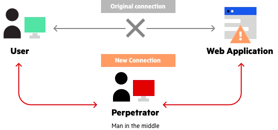
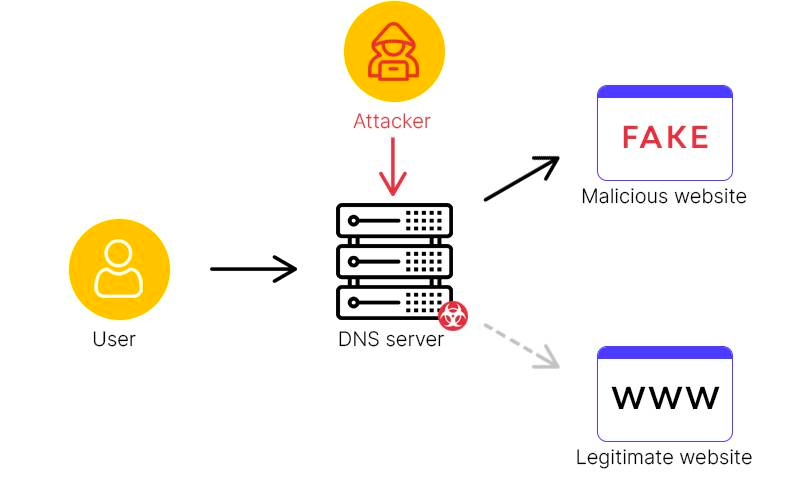
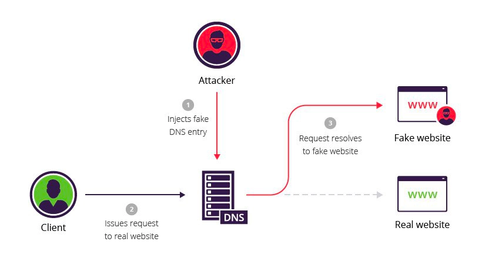
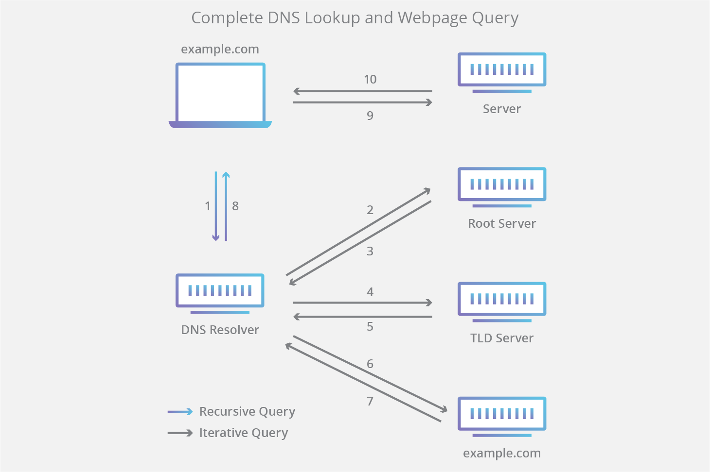
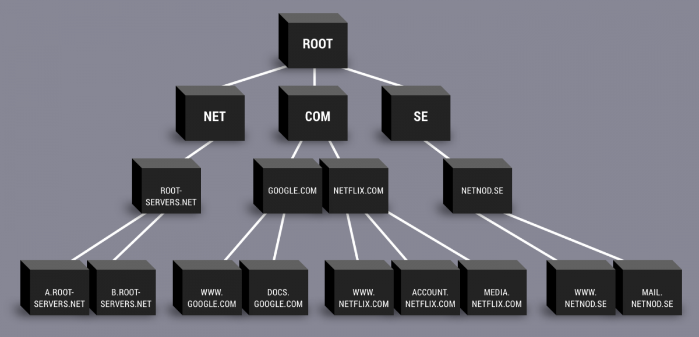
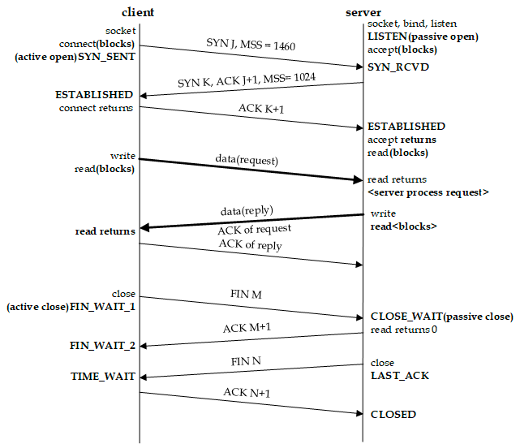

## 주소창에 www.google.com을 입력했을 때 일어나는 일

브라우저 주소창에 www.google.com을 입력했을 때 일어나는 일에 대해 살펴보겠습니다. 

> 이미지를 클릭하면 출처를 보실 수 있습니다.

    

## 1. host파일 

주소창에 www.google.com을 입력하면 우선 해당 도메인을 방문했던 이력을 조회합니다. 이를 위해서는 host 파일을 뒤지는데요, 이는 어떤 운영체제/리눅스를 사용하는지에 따라 경로가 다릅니다. 맥에서는 `uname -a` 명령어를 통해 볼 수 있으며 /etc/hosts에서 관리됩니다. 

> Darwin Jun.local 22.4.0 Darwin Kernel Version 22.4.0: Mon Mar  6 21:00:17 PST 2023; root:xnu-[xxxx.xxx.x]/RELEASE_X86_64 x86_64

        

해당 도메인을 방문했던 적이 없는 경우 DNS 쿼리를 통해 DNS 서버에 질의하게 됩니다. 이 과정에서는 3-way-handshaking이 발생하지 않는데요, 이는 UDP를 통해 통신하기 때문입니다. 하지만 일부 예외도 존재하는데, `DoT(DNS over TCP)`의 경우입니다. `DNS over TCP(DoT)`와 `DNS over TLS(DoT)`는 DNS 프로토콜을 보안하기 위해 사용되는 메커니즘입니다. 일반적으로 기존의 UDP를 사용하는 DNS 질의에 대한 보안 및 개인 정보 보호 기능을 추가합니다. 

        

### 1-1. DNS over TCP(DoT)

DNS 질의와 응답을 TCP를 통해 전송합니다. 이를 통해 연결 설정 및 데이터 신뢰성에 대한 추가적인 기능을 제공하며 일반적으로 853 포트를 사용합니다. 

    

### 1-2. DNS over TLS(DoT)

DNS 질의와 응답을 TLS(Transport Layer Security) 프로토콜을 통해 암호화된 연결로 전송합니다. TLS는 `인터넷상의 통신 보안을 위해 사용되는 프로토콜`로 `데이터의 기밀성`과 `무결성`을 보장합니다. 이는 853 또는 443 포트를 사용하여 DNS 서버와의 안전한 통신을 수행합니다.

        

### 1-3. Dot를 사용했을 때의 장점

이를 통해 보안적인 면을 추가해 DNS 질의 과정에서 `개인 정보 보호`와 `중간자 공격 방지` 등을 할 수 있습니다. 이들은 일반적으로 클라이언트와 DNS 서버 간의 통신을 암호화하고 인증하는 데 사용되며 일부 클라이언트 및 DNS 서버는 이러한 프로토콜을 지원합니다. 이에 대한 구체적인 예시를 몇 가지 살펴보겠습니다.

    

### 1-3-1. 공공 Wifi/공공 네트워크

보안 수준이 낮은 네트워크에서 DNS 트래픽을 보호할 수 있습니다. 이를 통해 중간자 공격이나 도청으로부터 안전한 통신을 할 수 있습니다.

    

### 1-3-2. 기업 네트워크

기업 네트워크에서 이를 사용해 DNS 트래픽을 암호화하고 외부에서의 도청을 방지할 수 있습니다. 민감한 정보나 내부 네트워크에 대한 보안 요구 사항을 충족시킬 수 있습니다. 

    

### 1-3-3. 개인 정보 보호

DNS 트래픽이 암호화되기 때문에 인터넷 서비스 제공자(ISP)나 다른 네트워크 관리자가 DNS 질의 내용을 엿볼 수 없습니다.

    

### 1-3-4. DNS 보안 강화

일부 악성 소프트웨어는 DNS를 조작하여 악성 활동을 수행할 수 있습니다. 트래픽을 암호화하면 이러한 유형의 공격을 방지하고 DNS의 안정성과 신뢰성을 향상시킬 수 있습니다. DNS를 공격하는 예시는 아래와 같은 것들이 있습니다. 

    

### [중간자 공격 (Man-in-the-Middle, MITM)](https://ko.wikipedia.org/wiki/%EC%A4%91%EA%B0%84%EC%9E%90_%EA%B3%B5%EA%B2%A9)

공격자가 통신 경로 중간에 위치하여 DNS 질의와 응답을 감청하거나 조작하는 공격입니다. 악의적인 공격자가 DNS 트래픽을 가로채어 도메인 이름과 IP 주소 사이의 매핑을 조작하거나 가로챈 정보를 이용하여 사용자를 다른 사이트로 리다이렉션할 수 있습니다.

        

### [도메인 하이재킹 (Domain Hijacking)](https://en.wikipedia.org/wiki/Domain_hijacking)

공격자가 도메인을 빼앗아 컨트롤하거나 해당 도메인에 대한 DNS 요청을 조작하는 공격입니다. 이에 대해 [해당 영상](https://www.youtube.com/watch?v=PAGTu-eoFyo)을 참조해 보실 것을 권장 드립니다.

> `도메인 하이재킹` 또는 `도메인 도용`은 원래 등록자의 허가 없이 도메인 이름 등록을 변경하거나 도메인 호스팅 및 등록 소프트웨어 시스템에 대한 권한을 남용하는 행위. -wiki

        

### [DNS 캐싱 중독 (DNS Cache Spoofing/Poisoning)](https://en.wikipedia.org/wiki/DNS_spoofing)

공격자가 DNS 서버의 캐시에 잘못된 도메인 이름과 IP 주소 매핑 정보를 주입하여 사용자를 악의적인 사이트로 리다이렉션하는 공격입니다.

        

## 2. DNS 서버 쿼리 

만약 .host 파일에 방문 이력이 존재하지 않는다면 DNS 서버에 질의를 합니다. 이때 DNS 캐시에 우리가 찾는 도메인이 있는지를 확인하는데요, 도메인에 접속할 때마다 해당 아이피 주소를 캐시에 저장하기 때문입니다. 만약 있다면 IP 주소를 바로 반환하며 없다면 `DNS Resolver`를 확인합니다. DNS Resolver란 DNS 서버에서 IP 주소를 질의하는 역할을 하는데 이는 [루트 네임 서버](https://ko.wikipedia.org/wiki/%EB%A3%A8%ED%8A%B8_%EB%84%A4%EC%9E%84_%EC%84%9C%EB%B2%84)에 접속하려는 사이트의 IP 주소를 묻습니다. 

        

루트 네임 서버는 top-level 도메인(.com, .io 등) 서버의 IP 주소를 가지고 있으며, 이를 DNS-Resolver에 전달합니다. top이 있다면 그 아래(second) 서버도 있는데요, second-level 도메인 서버는 top-level 서버에서 정보를 알고 있습니다. second-level 도메인 서버는 해당 URL의 IP 주소를 가지고 있으며 서브 도메인도 여기서 관리합니다. 여튼 여기서 정보를 가져와 사용자에게 반환합니다.

> 즉 DNS 서버는 일반적으로 상위 도메인 서버에 대한 정보만 가지고 있으며, 서브 도메인의 값에 대한 직접적인 정보는 상위 도메인의 네임 서버에 의해 관리됩니다.

        

참고로 루트 서버 뿐 아니라 그 밑에 여러 개의 하위 DNS 서버를 가지고 있으며 하위 서버에서 구체적인 정보(URL, IP주소) 등을 가지고 있습니다. 

        

## 3. 3-way-handshake

이후 3-way-handshake를 통해 해당 서버와 통신이 가능한지를 확인합니다. 

        

이 과정에서 OSI 7Layer를 거치게 되는데요, 이때 클라이언트 측에서 `7계층 -> 1계층`, 서버 측에서는 `1계층 -> 7계층`을 거쳐 메시지가 전송됩니다. 서버 측에서 전송할 때는 반대입니다.

> 이는 3-way-handshake가 끝나고 난 후에도 동일한 순서로 통신합니다.

        

이를 그림으로 보면 아래와 같습니다. OSI 7Layer에 대해서는 추가 포스팅에서 살펴보겠습니다.

