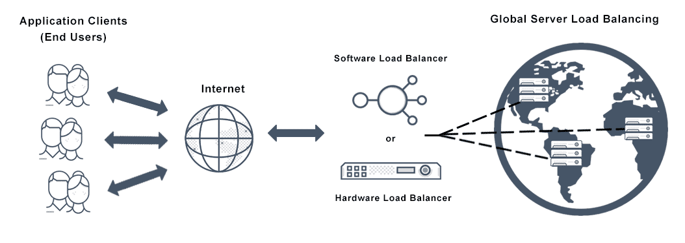
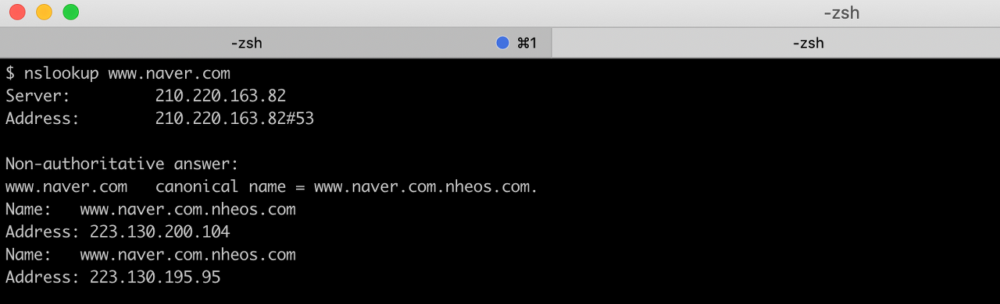
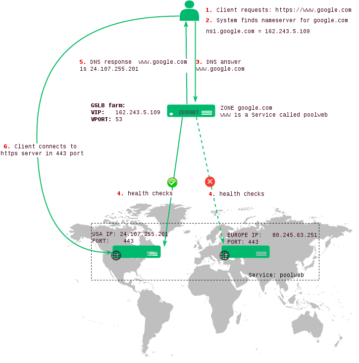
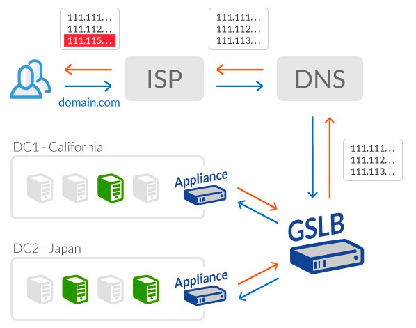

## GSLB(Global Server Load Balancing)

전통적인 DNS와 같이 동작하며 추가로 health check와 active/backup을 지정할 수 있게 하여 재해 복구(DR), 지역적인 부하분산, 응답시간 중심의 서비스를 제공하는 서비스. 이는 다양한 지리적 영역에 있는 여러 데이터 센터 및/또는 public/private 클라우드를 통한 웹 트래픽 관리 및 애플리케이션 서비스를 제공합니다. 이는 로드 밸런서에 의해 관리되며 클라이언트 요청은 일반적으로 대기 시간을 최소화하고 성능을 최대화하기 위해 더 가까운 서버로 전송됩니다.

> 이미지를 클릭하면 출처를 보실 수 있습니다.

        

큰 회사들은 CDN과 GSLB를 이용하고 있는데, 때문에 nslookup을 입력하게 되면 아래와 같은 주소가 나옵니다. 해당 IP는 고정 IP가 아닌 변할 수 있는 `가변 IP`인데, 이를통해 정적 콘텐츠는 캐싱하고 최적의 IP를 제공해 우리가 효율적이고 안정적인 서비스를 이용할 수 있게 해줍니다. 

        

## 1. 등장 배경

`DNS는 서버의 상태를 알 수 없습니다.` 즉 서버의 IP 주소를 알 수는 있지만 해당 서버가 가동 중인지 등의 상태를 파악할 순 없으므로 네트워크 지연, 성능, 트래픽 유입, 서비스 실패 등을 고려할 수 없습니다. 하지만 GSLB는 서버의 상태를 관리(health check)하기 때문에 실패한 서버의 IP는 응답에서 제외하며 사용자가 서비스를 계속해서 이용할 수 있습니다.

 

그뿐만 아니라 네트워크 지연, 지리적 특성까지 고려하기 때문에 트래픽이 몰리지 않은, 그리고 가장 가까운 서버의 IP를 반환해 줄 수 있으며 이를 통해 정교한 로드밸런싱이 가능합니다. 따라서 DNS가 가진 한계점을 극복하고 더 나은 서비스를 제공하기 위해 등장하게 되었습니다.

        

## 2. 원리 

우리가 서버에 요청을 보내면 접속자 IP를 보고 위치를 파악합니다. 이후 평소 헬스체크를 통해 안전한/최적의 IP주소를 찾아 우리에게 알려 줍니다.

> GSLB를 구현할때는 DNS로 특정 시스템을 만들어 사용합니다.

        

즉 이를 요약하면 아래와 같습니다. 

&nbsp;&nbsp; 1. 클라이언트 HTTPS 요청  
&nbsp;&nbsp; 2. 서버는 클라이언트의 IP 주소를 획득하고 클라이언트의 위치 정보를 분석  
&nbsp;&nbsp; 3. 서버는 상태 점검을 수행하여 서버의 실시간 성능과 응답성을 평가  
&nbsp;&nbsp; 4. 지리적으로 가장 가깝거나 응답 시간이 가장 짧은 로컬 DNS 서버로 요청을 전달  

        

조금 더 상세히 살펴보면 아래와 같은데요, DNS 서버에 쿼리를 한 후 GSLB를 사용하는 것입니다. 

    

### DNS 쿼리
사용자가 웹 브라우저 또는 애플리케이션을 통해 도메인 이름을 입력하면 클라이언트는 DNS 서버에 해당 도메인의 IP 주소를 조회.

  

### GSLB 리다이렉션
DNS 서버는 도메인 이름에 대한 IP 주소 대신 GSLB 서비스의 IP 주소를 반환. 즉 클라이언트의 DNS 쿼리를 GSLB 서비스로 리다이렉트 합니다.

  

### 클라이언트 위치 확인

GSLB 서비스는 클라이언트의 IP 주소를 사용하여 클라이언트의 위치를 확인합니다. 이는 일반적으로 `클라이언트의 IP 주소 범위` 또는 `지리적 위치 정보`를 기반으로 판단 합니다.

  

### 가용한 서버 선택
현재 가용한 서버 또는 데이터 센터의 상태와 부하 정보를 고려하여 최적의 서버를 선택합니다. 이는 로드 밸런싱을 통해 수행됩니다. 

  

### 응답
GSLB는 최적의 서버의 IP 주소를 DNS 응답으로 반환하여 클라이언트에게 전달합니다. 클라이언트는 이 IP 주소를 사용하여 요청을 해당 서버로 보냅니다.

> 이 과정에서 트래픽과 지속적 헬스 체크로 최적의 서비스를 제공합니다. 

        

## 3. 이점

이를 통해 얻을 수 있는 이점은 다양한데요, 크게 `성능`, `적절한 컨텐츠 제공`, `재해 복구`, `관리의 용이성` 정도가 있습니다.  

    

### 3-1. 성능

사용자 요청을 가장 가까운 서버로 전달하기 때문에 네트워크 지연 및 네트워크 문제를 최소화할 수 있습니다. 이는 지리적으로 분산된 지역의 고객에게 최적의 웹사이트 또는 서비스 성능을 보장합니다.

  

### 3-2. 적절한 컨텐츠 제공

해당 지리적 위치 및 언어와 관련되도록 사용자 지정된 로컬 서버에서 컨텐츠를 호스팅할 수 있습니다. 즉 가장 가까운 서버뿐 아니라 해당 국가에 맞는 적절한 언어로 서비스를 제공할 수 있습니다.

  

### 3-3. 재해 복구

애플리케이션 고가용성은 데이터 센터 또는 네트워크 장애의 영향을 최소화합니다. 예를 들어 정전이 발생하면 로드 밸런서는 클라이언트 요청을 지리적으로 분산된 여러 사이트에서 호스팅해서 다른 서버로 리다이렉션합니다.

  

### 3-4. 관리

클라이언트 요청을 다른 곳의 서버로 간단히 리다이렉션할 수 있으므로 데이터 센터 마이그레이션 및 업데이트를 무중단 방식으로 진행할 수 있습니다. 그뿐만 아니라 해당 국가에서 문화로 인한 특별한 규제가 있는 경우 이를 더욱 쉽게 준수할 수 있습니다.

> GSLB를 학습하다 보면 [데이터 센터](https://ko.wikipedia.org/wiki/%EB%8D%B0%EC%9D%B4%ED%84%B0_%EC%84%BC%ED%84%B0)라는 개념이 등장하는데요, 이는 서버 컴퓨터와 네트워크 회선 등을 제공하는 건물이나 시설을 말합니다. 데이터 센터를 구축하기 위해서는 일정 이상의 거리가 확보되어야 하는 것과 같은 제약 사항이나 법적 규제가 존재합니다. 이에 대해서는 별도로 학습해 보실 것을 권장해 드립니다. 

        

## 4. CDN과의 차이점

CDN(Content Delivery Network)과 GSLB은 모두 웹 사이트와 애플리케이션의 성능 개선을 위한 기술입니다. 하지만 이 둘은 목적이 다른데요, CDN은 콘텐츠 전달 속도를 향상하기 위한 기술로 `정적인 콘텐츠에 주로 사용`되며 GSLB은 `여러 지리적인 위치에 있는 서버 또는 데이터 센터 간의 트래픽 분산을 관리하기 위한 기술`로 `동적인 콘텐츠나 애플리케이션 서버에 주로 사용`됩니다.

> CDN은 `웹 콘텐츠의 전달 속도를 향상하기 위한 기술`로 전 세계에 분산된 여러 대의 서버를 가지고 있습니다. 사용자는 가장 가까운 서버에서 콘텐츠를 받기 때문에 지연 시간이 줄어들고 네트워크 병목 현상이 감소하여 더 빠른 콘텐츠 전달 속도를 경험할 수 있습니다. 이는 주로 정적인 콘텐츠(image, CSS, JS 파일 등)의 전송에 사용되며, 캐싱, 압축, 네트워크 최적화 등의 기술을 활용하여 성능을 향상합니다.
