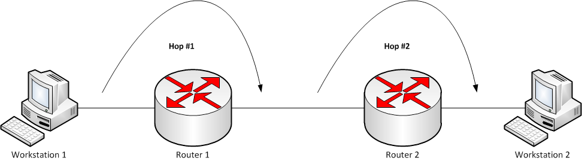

## 홉(hop)

홉에 대해 살펴보겠습니다.

> 이미지를 클릭하면 출처를 보실 수 있습니다.


<br/><br/><br/><br/>

[`컴퓨터 네트워크에서 출발지와 목적지 사이에 위치한 경로의 한 부분.` 데이터 패킷은 브리지, 라우터, 게이트웨이를 거치면서 출발지에서 목적지로 경유하며, 패킷이 다음 네트워크 장비로 이동할 때마다 홉이 하나 발생합니다. 홉 카운트(hop count)는 데이터가 출발지와 목적지 사이에서 통과해야 하는 중간 장치들의 개수를 가리킵니다.](https://ko.wikipedia.org/wiki/%ED%99%89_(%EB%84%A4%ED%8A%B8%EC%9B%8C%ED%81%AC))

[](https://ko.wikipedia.org/wiki/%ED%99%89_(%EB%84%A4%ED%8A%B8%EC%9B%8C%ED%81%AC))

<br/><br/><br/><br/><br/><br/><br/><br/>

이는 `traceroute` 명령어를 통해 확인할 수 있는데요, 최대 64개의 홉을 경유할 수 있습니다. 64개의 홉을 초과하면 패킷이 드랍됩니다. 하나의 홉을 지날 때마다 *가 터미널에 기록되며 홉 카운트(Hop
Count)가 1씩 감소합니다. 64개가 작게 느껴지실 수 있는데요, 사실 64개를 초과하는 경우는 그다지 많이 발생하지 않으며 64개 미만으로 전 세계를 순회(?)할 수 있습니다.

```shell
$ traceroute www.naver.com
traceroute: Warning: www.naver.com has multiple addresses; using 223.xxx.200.xxx
traceroute to www.naver.com.nheos.com (223.130.200.104), 64 hops max, 52 byte packets
 1  192.168.0.1 (192.168.0.1)  1.611 ms  1.216 ms  1.281 ms
 2  192.168.30.1 (192.168.30.1)  1.672 ms  1.590 ms  1.641 ms
 3  210.121.162.254 (210.121.162.254)  3.673 ms  3.237 ms *
 4  112.190.45.117 (112.190.45.117)  3.251 ms  3.821 ms  3.087 ms
 5  112.190.34.105 (112.190.34.105)  3.950 ms
    112.190.34.233 (112.190.34.233)  2.903 ms
    112.190.35.41 (112.190.35.41)  3.926 ms
 6  * * *
 7  * 112.174.75.106 (112.174.75.106)  3.476 ms
    112.174.75.14 (112.174.75.14)  3.440 ms
 8  218.145.42.78 (218.145.42.78)  6.899 ms  6.717 ms
    128.134.40.174 (128.134.40.174)  9.734 ms
 9  * * *
```

> 이전에는 *가 아닌 실제 모든 IP 주소가 나왔지만 현재는 보안상의 이유로 일부 주소는 보이지 않습니다.

<br/><br/><br/><br/><br/><br/><br/><br/>

여기에는 몇 가지 개념이 등장하는데요, 이에 대해 간략하게 알아보겠습니다.

- Next Hop: 목적네트워크까지 가기위한 다음 라우터
    - 수신된 패킷의 헤더를 통해 라우팅 테이블에 존재하는 최적의 경로에 있는 다음 홉 라우터 인터페이스를 찾습니다.
    - 이후 패킷을 다음으로 홉 할 라우터를 향하는 인터페이스에 넘겨 전달합니다.

- Hop Count: 거치는 라우터의 수.
    - 이와 관련해서는 [RIP](http://www.ktword.co.kr/test/view/view.php?m_temp1=178&id=439)에 대해 참조.


