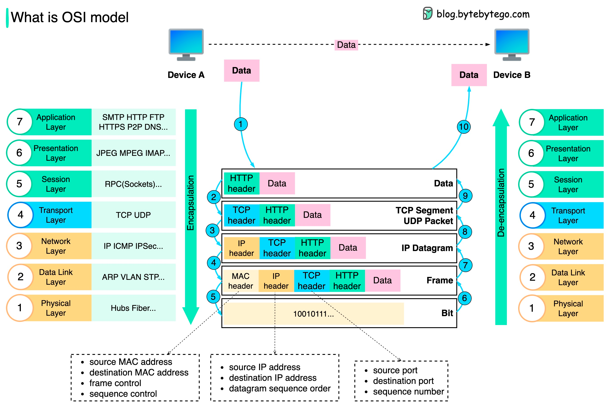
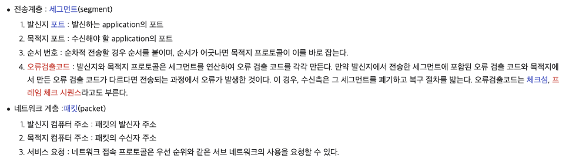
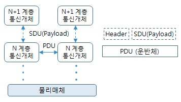
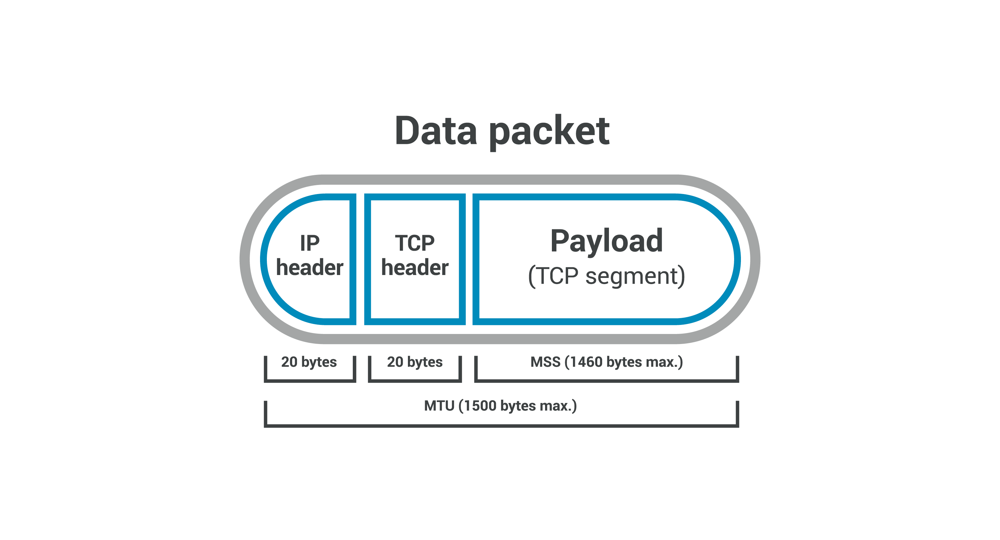
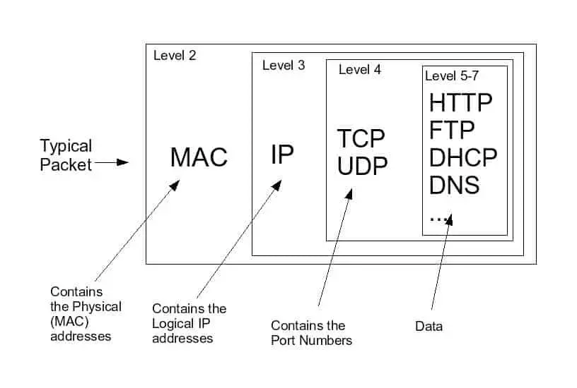
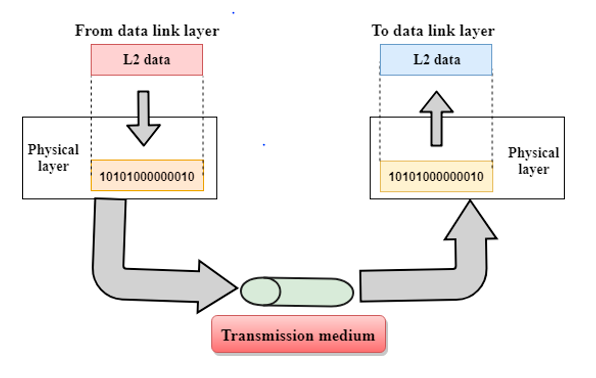

## OSI 7Layer

OSI 7Layer에 대해 살펴보겠습니다. 

> 이미지를 클릭하면 출처를 보실 수 있습니다.

<br/><br/><br/><br/><br/><br/><br/><br/>

[OSI 모형(Open Systems Interconnection Reference Model)은 국제표준화기구(ISO)에서 개발한 모델로, 컴퓨터 네트워크 프로토콜 디자인과 통신을 계층으로 나누어 설명한 것입니다.](https://ko.wikipedia.org/wiki/OSI_%EB%AA%A8%ED%98%95) 상위 계층 프로토콜이 제대로 동작하기 위해서는 하위 계층에 문제가 없어야 합니다. 각 계층에서 페이로드에 헤더를 붙여 PDU를 만들어 한 단계 아래 계층으로 전달하는 데 필요한 헤더/데이터를 추가하는데 이 과정을 `캡슐화(encapsulation)`라고 합니다. OSI 7Layer를 학습하기 위해서는 기본적인 용어를 알고 있어야 하는데요, 이에 대해 간략히 정리해 보겠습니다.

[](https://www.youtube.com/watch?v=0y6FtKsg6J4)


<br/><br/><br/><br/><br/><br/><br/><br/>

### 1.1 PDU

여기에는 [PDU(Protocol Data Unit)](https://ko.wikipedia.org/wiki/%ED%94%84%EB%A1%9C%ED%86%A0%EC%BD%9C_%EB%8D%B0%EC%9D%B4%ED%84%B0_%EB%8B%A8%EC%9C%84)이 등장하는데요, 이는 `계층에서 처리하는 한 덩어리의 데이터 단위`를 말합니다. 정보를 추가한 계층에 따라 PDU를 지칭하는 이름과 포함하는 내용이 달라집니다. 즉 PDU는 `PCI + SDU` 입니다.


[](https://ko.wikipedia.org/wiki/%ED%94%84%EB%A1%9C%ED%86%A0%EC%BD%9C_%EB%8D%B0%EC%9D%B4%ED%84%B0_%EB%8B%A8%EC%9C%84)

<br/><br/><br/><br/><br/><br/><br/><br/>

### 1.2 SDU

[SDU](http://www.ktword.co.kr/test/view/view.php?m_temp1=310)(Service Data Unit)은 `상향/하향 두 통신 계층 간 전달되는 실제 정보`를 말합니다. 즉 `상향 계층으로부터 보내진 실제 정보가 들어있는 데이터`입니다. 이는 PDU화 하기 위해 [쪼개지거나](http://www.ktword.co.kr/test/view/view.php?m_temp1=393&id=772) [합쳐질 수](http://www.ktword.co.kr/test/view/view.php?m_temp1=2485&id=1154) 있습니다.  



<br/><br/><br/><br/><br/><br/><br/><br/>

### 1.3 데이타그램(Datagram)

[`패킷교환에서 각각 독립적으로 취급되는 각각의 패킷`](http://www.ktword.co.kr/test/view/view.php?m_temp1=634)을 말합니다. 이는 아래와 같은 특징을 가지고 있습니다. 

&nbsp;&nbsp; - Connectionless 방식으로써, 사전에 연결설정을 하지 않습니다. <br/>
&nbsp;&nbsp; - 각 패킷들을 독립적으로 처리하며 순서와 무관하게 전달됩니다. <br/>
&nbsp;&nbsp; - 목적지가 같은 패킷이라도 항상 같은 경로를 따르지 않습니다. <br/>

<br/><br/><br/><br/><br/><br/><br/><br/>

### 1-4. 패킷(Packet)

패킷 데이터(정보)를 일정 크기로 자른 것을 말하는데요, 통상 헤더, 데이터, 트레일러로 구성됩니다. [이는 물리 계층에서 정의되는 파형, 비트, 심볼 등과는 달리 망 계층(Layer 3) 이상에서 정의되는 데이터 단위입니다.](http://www.ktword.co.kr/test/view/view.php?m_temp1=421&id=484) 패킷은 헤더, 페이로드, 트레일러로 구성되어 있는데요, 헤더에는 패킷의 송수신 주소 등과 같은 주요 제어 정보들이 포함되어 있습니다. 트레일러는 패킷 에러 검출 등에 사용되는 정보가 담겨있으며 이는 존재하지 않을 수도 있습니다.

[](https://www.cloudflare.com/learning/network-layer/what-is-mss/)

<br/><br/><br/><br/><br/><br/><br/><br/>

이는 네트워크 계층에서 정의되는 데이터 단위인데요, 하지만 OSI의 각 계층에서 주고받는 정보의 단위도 모두 패킷이라고 뭉뚱그려 칭하기도 합니다. ATM 셀과 비교할 수 있는데 이는 고정 길이(53byte, 헤더(5)/페이로드(48))지만 패킷은 가변 길입니다.

> 인터넷에서는 IP 데이타그램을 패킷이라고 합니다. 

<br/><br/><br/><br/><br/><br/><br/><br/>

패킷은 아래 계층으로 갈 수록 헤더에 정보가 더해집니다. 

[](https://networkencyclopedia.com/network-packet/)

<br/><br/><br/><br/><br/><br/><br/><br/>


## 1. 물리 계층(Physical Layer)

[네트워크의 기본 네트워크 하드웨어 전손 기술을 이룹니다. 하드웨어 기술이 접목되어 있기에 OSI 아키텍처에서 가장 복잡한 계층입니다.](https://ko.wikipedia.org/wiki/OSI_%EB%AA%A8%ED%98%95) 물리 계층에는 `케이블`, `스위치` 등 데이터 전송과 관련된 물리적 장비가 포함되며 1과 0의 문자열인 비트 스트림으로 변환되는 계층입니다.

> 뿐만 아니라 두 장치의 물리적 계층은 신호 규칙에 동의해서 두 장치의 1이 0과 구별될 수 있어야 합니다.


<br/><br/><br/><br/><br/><br/><br/><br/>

이는 아래와 같은 특징을 가지고 있습니다.

&nbsp;&nbsp; - 최하위 계층으로 전기적 신호 상태로 이루어져 있으며 데이터를 전달 합니다. <br/>
&nbsp;&nbsp; - 전기적, 기계적, 기능적 특성을 이용해 데이터를 전송 합니다.<br/>
&nbsp;&nbsp; - 전기적 신호 상태로 이루어져 해당 계층은 단지 데이터를 전달만 합니다.<br/>
&nbsp;&nbsp; - 장비로는 케이블, 리피터, 허브가 있습니다. <br/>

```yaml
- PDU : Bit
- 프로토콜 : Modem, Cable, Fiber, RS-232C 등
- 장비 : 허브, 리피터 등
```
<br/><br/><br/><br/><br/><br/><br/><br/>

## 2. [데이터링크 계층(Data-Link Layer)](https://ko.wikipedia.org/wiki/%EB%8D%B0%EC%9D%B4%ED%84%B0_%EB%A7%81%ED%81%AC_%EA%B3%84%EC%B8%B5)

장치 간 신호를 전달하는 물리 계층을 이용해 `네트워크상의 주변 장치 간 데이터를 전송`합니다. 이는 동일한 네트워크에 있는 두 개의 장치 간 데이터 전송을 용이하게 하는데, 네트워크 계층에서 패킷을 가져와서 `프레임`이라는 더 작은 조각으로 세분화합니다. 데이터링크 계층은 네트워크 통신에서 `흐름 제어` 및 `오류 제어`를 담당합니다. 

> 만약 신호가 전달되는 동안 오류가 포함되면 [링크 계층에서 해당 데이터를 파기](https://ko.wikipedia.org/wiki/%EB%8D%B0%EC%9D%B4%ED%84%B0_%EB%A7%81%ED%81%AC_%EA%B3%84%EC%B8%B5)합니다.

> 전송 계층은 네트워크 간 통신에 대해서만 흐름 제어 및 오류 제어만을 담당하며 데이터링크 계층은 여기서 흐름 제어 및 오류 제어를 담당하는 차이가 있습니다. 


<br/><br/><br/><br/><br/><br/><br/><br/>

데이터링크 계층은 하드웨어/소프트웨어적 특성을 모두 가지고 있는데요, 즉 소프트웨어로부터 정보를 전달받으면 이를 하드웨어로 연결해 줍니다.

[](https://www.includehelp.com/computer-networks/functions-of-physical-layer-in-the-osi-model.aspx)

> 물리 계층은 하드웨어적 특성을 가지고 있으며 네트워크 계층부터 소프트웨어적 특성을 가지고 있습니다.

<br/><br/><br/><br/><br/><br/><br/><br/>

우리가 통신할 때 네트워크 계층에서 목적지 IP를 부여해 통신하는데, 이 과정에서 데이터링크 계층은 `직접 연결된 서로 다른 두 개의 네트워크 장치 간 데이터 전송`을 해줍니다. 해당 계층에는 `Mac Address`가 존재하는데 이는 데이터링크 계층에서 이웃 노드와 통신에 사용됩니다. 요약해 보면 `특정 구간 내에서 통신만 담당하는 계층`이며, 이 과정에서 `오류 없는 통신을 위한 다양한 역할`을 합니다.

> 즉 직접 연결되지 않은 장치에는 데이터를 보낼 수 없습니다.

<br/><br/><br/><br/><br/><br/><br/><br/>

Mac Address(Media Access Control Address)는 `NIC(Network Interface Card) 내부의 ROM(Read-Only Memory)에 포함`되어 있습니다. 이는 고유한 식별자로 `물리적 주소`라고 부릅니다. 이는 컴퓨터뿐 아니라 라우터 스위치와 같은 통신 장비에도 부여되어 있는데, IP 주소는 가변적이지만 Mac Address는 불변이기 때문에 이를 통해 구체적 대상을 찾을 수 있습니다.

<br/><br/>

이를 정리해 보면 데이터 링크 계층은 `네트워크 계층과 물리적인 통신 매체(또는 물리 계층) 사이에서 데이터를 전송하는 데 사용되는 계층`입니다. 노드 간의 직접적인 통신을 관리하고 오류 감지 및 복구, 흐름 제어, 주소 지정 등의 기능을 제공하며 Mac Address를 사용해 네트워크상의 인터페이스를 식별합니다. 이는 노드(장치)의 고유한 식별자로 사용되어 경로, 주소를 정하고 경로에 따라 패킷을 빠르게 전달해 줍니다.

> 주소 지정은 데이터 링크 계층의 중요한 역할 중 하나입니다.


<br/><br/><br/><br/><br/><br/><br/><br/>

여기서 `"IP 주소가 있는데 MAC 주소가 왜 필요할까?"`와 같은 의문이 들 수 있는데요, IP 주소는 `논리적 주소`이며 Mac Address는 `물리적 주소`입니다. 즉 같은 IP 주소라도 Mac Address가 다르면 구별할 수 있습니다. IP 주소 대신 항상 Mac Address만 사용한다면 라우팅 테이블(Routing Table)에 너무 많은 정보가 기록될 것입니다. 따라서 IP 주소와 Mac Address를 모두를 이용합니다. 

> `ARP(Address Resolution Protocol)`는 `네트워크상의 논리적 IP 주소를 물리적 네트워크 주소(MAC Address)로 대응시키기 위해 사용되는 프로토콜`입니다. 즉 IP 주소와 MAC 주소를 일대일 매칭시켜 LAN(Local Area Network)에서 목적지를 찾아갈 수 있도록 하는 프로토콜입니다. IP 주소와 Mac Address를 일대일 대응시킨 테이블을 ARP Table이라고 하는데 이에 대해서는 다음에 살펴보겠습니다.


<br/><br/><br/><br/><br/><br/><br/><br/>

이는 아래와 같은 역할을 수행합니다. 

&nbsp;&nbsp; - 프레이밍(Framing):  물리 계층을 통해 수신한 신호를 조합해 프레임(Frame) 단위의 데이터 유닛으로 만듭니다. <br/>
&nbsp;&nbsp; - 흐름 제어(Flow Control): 송신 측과 수신 측 간 데이터 통신에 너무 많은/적은 데이터를 송수신 하지 않도록 흐름을 적절히 제어합니다. 

&nbsp;&nbsp; - 오류 제어(Error Control): 프레임 전송 시 발생한 오류를 복원/재전송 <br/>
&nbsp;&nbsp; - 접근 제어(Access Control): 매체 상 통신 주체가 여럿 존재할 때 데이터 전송 여부 결정 <br/>
&nbsp;&nbsp; - 동기화(Synchronization): 프레임 구분자

````yaml
- PDU : 프레임(Frame)
- 프로토콜 : 이더넷, Mac, PPP, ATM, LAN 등
- 장비 : 브릿지, 스위치 등
````

<br/><br/><br/><br/><br/><br/><br/><br/>

## 3. 네트워크 계층(Network Layer)

[`서로 다른 두 네트워크 간 데이터 전송을 용이하게 하는 역할`을 합니다. 네트워크 계층은 전송 계층의 세그먼트를 송신자의 장치에서 패킷이라고 불리는 더 작은 단위로 세분화하여 수신 장치에서 이러한 패킷을 다시 조립합니다.](https://www.cloudflare.com/ko-kr/learning/ddos/glossary/open-systems-interconnection-model-osi/)

> 두 장치가 동일한 네트워크에 있는 경우에는 네트워크 계층이 필요하지 않습니다.


<br/><br/><br/><br/><br/><br/><br/><br/>

네트워크 계층은 데이터가 목적지에 도달하기 위한 최상의 물리적 경로를 찾는데 이를 `라우팅`이라고 합니다.  
