## System-Structure & Program-Execution

[Kocw 반효경 교수님의 운영체제](http://www.kocw.net/home/search/kemView.do?kemId=1046323) 강의를 학습하며 정리한 글입니다. 학습 과정에서 작성되었기 때문에 잘못된 내용이 있을 수 있으며 이에 대한 지적/피드백은 언제든 환영입니다.

> 이미지를 클릭하면 출처를 알 수 있습니다.

        

컴퓨터 시스템은 크게 CPU(Central Processing Unit), 메모리, 외부 장치(I/O Device) 등으로 구성되어 있습니다. CPU와 장치 컨트롤러들은 메모리 사이클을 얻기 위해 경쟁하며, 이때 공유하는 메모리에 순차적으로 접근할 수 있도록 메모리 컨트롤러가 이를 제어합니다. 

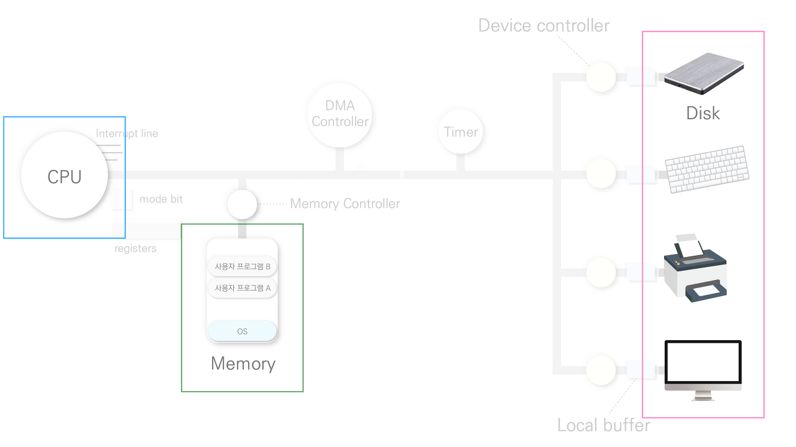

> 메모리 컨트롤러(memory controller)는 메인보드나 중앙 처리 장치 위에 있는 칩으로 메모리에서 오가는 자료를 관리하는 데 사용됩니다.

        

## 1. 인터럽트(Interrupt)

`CPU가 특정 기능을 수행하는 도중 다른 일을 처리하는 것`을 말합니다. 인터럽트가 발생하면 CPU의 제어권이 운영체제로 넘어가서 요청된 작업을 처리합니다. 이때 CPU는 인터럽트를 당한 시점의 문맥(레지스터, program counter 등)을 저장하고 CPU의 제어를 인터럽트 처리 루틴에 넘깁니다. 운영체제는 인터럽트마다 실행할 코드를 내부에 커널 함수(상황에 맞게 처리해야 할 것들)로 정의하고 있으며 각 요청에 맞는 인터럽트를 처리합니다. 인터럽트를 처리 중일 때는 다른 장치로부터 온 명령을 알 수 없으므로 불규칙한 요청 처리에도 적합합니다. 인터럽트가 완료되면 CPU는 작업 중이던 문맥으로 돌아와서 다시 작업을 수행합니다.

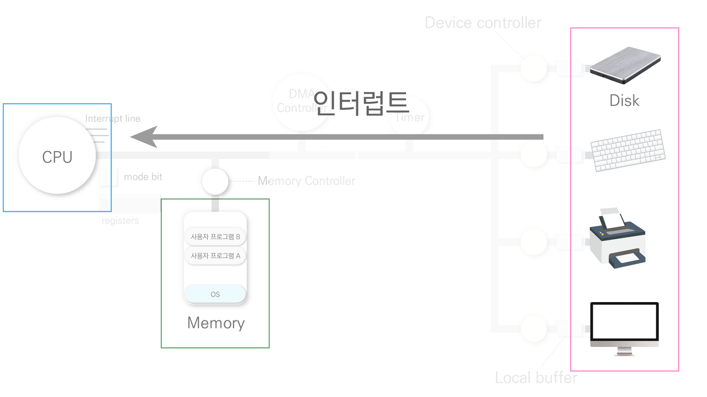

> I/O Device의 인터럽트

> 예를 들어 키보드의 엔터를 누르면 엔터 키의 코드 값이 키보드 버퍼에 입력된 후 CPU에 인터럽트가 걸립니다. CPU는 현재 처리 중인 작업에 대한 문맥을 저장한 후 인터럽트 서비스 루틴(Interrupt Service Routine)을 수행(키보드 버퍼에 있는 키 코드 값 처리)합니다. CPU는 인터럽트가 종료되면 이전에 처리하던 작업으로 돌아가 다시 작업을 수행합니다.

        

CPU에 오는 작업을 Interrupt Line을 통해 확인할 수 있습니다.

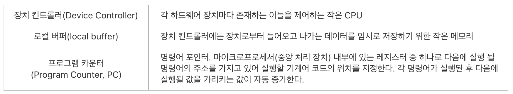

        

### 1-2. 발생 및 처리 

[I/O Device Controller는 CPU에 인터럽트를 요청](https://www.tutorialspoint.com/operating_system/os_io_hardware.htm)하고 `CPU는 인터럽트 라인을 통해 발생한 인터럽트를 확인`합니다. 이후 `인터럽트 벡터`를 통해 해당 인터럽트에 대해 어떤 루틴을 실행해야 하는지 루틴이 담겨있는 메모리의 주소를 알아낸 후 해당 루틴을 찾아가 일을 처리합니다. 

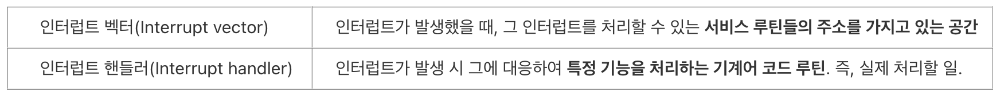

> 인터럽트의 종류는 다양하고 각자 하는 일이 다릅니다. 역할이 정의되어 있고 그 실제 코드를 처리 루틴이라고 부르며, 인터럽트가 왔을 때 어떤 함수를 실행해야 하는지 정의해 놓은 테이블은 벡터라고 부릅니다.

        

### 1-3. 종류

인터럽트는 `하드웨어/소프트웨어` 인터럽트로 나눌 수 있습니다. 일반적으로 하드웨어가 일으키는 인터럽트를 넓은 의미의 인터럽트라고 하며, 소프트웨어가 발생시키는 인터럽트를 좁은 의미의 인터럽트라고 합니다.

        

### 1-3-1. 하드웨어 인터럽트(Hardware Interrupt)

CPU 외부의 디스크 컨트롤러나 주변장치로부터 요청되며, 운영체제의 처리를 해야 하는 상황을 알리기 위해 전기적 신호를 사용해 구현됩니다.

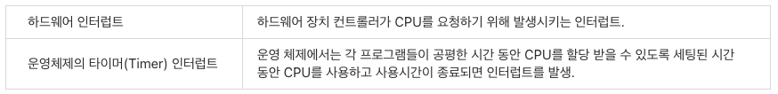

- 기계검사 인터럽트
- 외부 인터럽트
- 입출력 인터럽트
- 프로그램검사 인터럽트

        

### 1-3-2. 소프트웨어 인터럽트(Software Interrupt)

`프로세스가 운영 체제의 서비스를 요청하기 위해 커널의 함수 호출하는 경우 발생하는 인터럽트`를 말합니다. 즉 사용자 프로그램이 운영체제의 서비스를 받기 위해 커널 함수를 호출(System call)하는 것인데, 시스템 호출은 특별한 시스템 호출 예외를 사용해 구현되어 있으며, 이는 트랩(trap)이라고도 부릅니다. 보통 C나 C++과 같은 고급 언어로 작성된 프로그램들은 직접 시스템 호출을 사용할 수 없으므로 API를 통해 시스템 호출에 접근합니다.

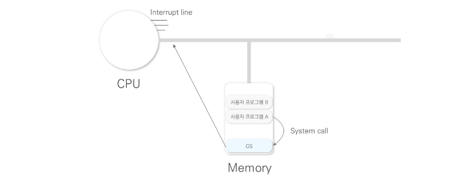

        

하드웨어 제어를 하는 모든 권한은 커널에서 가지고 있기 때문(보안상, 동시성 등의 문제 등)에 사용자 프로그램, 파일 시스템 등의 경우 응용 프로그램에서 이를 직접 제어할 수 없습니다. 따라서 응용 프로그램에서 하드웨어의 데이터를 가져오거나 쓰기 위해서는 커널의 장치 드라이버와 연동되어 실행되어야 합니다. 결국 응용 프로그램이 파일 시스템을 이용하려면 커널의 파일 시스템 드라이버로 넘어가 실행되어야 하므로 시스템 호출 방법을 사용합니다.

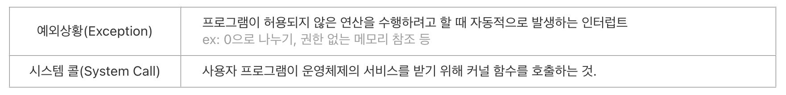

        

사용자 프로그램이 입출력 작업을 하기 위해서는 시스템콜을 통해 운영체제에 요청하고 운영체제가 이를 대신 수행합니다. 운영체제는 입출력 요청이 올바른 요청인지 확인한 후 입출력을 실행하기 때문에, 파일에 대한 보안을 유지할 수 있습니다. 입/출력의 수행은 아래와 같은 과정을 거치게 됩니다.

&nbsp;&nbsp; - 시스템 콜(System call): 사용자 프로그램은 운영체제에게 I/O요청  
&nbsp;&nbsp; - trap을 사용해 인터럽트 벡터의 특정 위치로 이동 
&nbsp;&nbsp; - 제어권이 인터럽트 벡터가 가리키는 인터럽트 서비스 루틴으로 이동 
&nbsp;&nbsp; - 올바른 I/O 요청인지 확인 후 I/O 수행(커널이 장치컨트롤러에 데이터 요청, 현재 작업중인 프로세스 비활성화) 
&nbsp;&nbsp; - 장치 컨트롤러는 데이터를 메모리로 전송한 후 CPU에 인터럽트 
&nbsp;&nbsp; - I/O 완료 시 제어권을 시스템콜 다음 명령으로 옮김 

        

예를 들어 강제로 exception이 넘어가면 (0으로나 눈다거나 사용자 프로그램이 범위를 초과한 요청) 강제로 프로그램을 종료시킵니다. 이때 타이머가 인터럽트(타이머 인터럽트)를 걸 수도 있습니다.

- 하드웨어 고장(Hardware Interrupt)
  - 컴퓨터 고장
  - 데이터 전달 과정에서의 비트 오류
  - 전원이 나간 경우

- 실행할 수 없는 명령어 : 기억장치에서 인출한 명령어의 비트 패턴이 정의되어 있지 않은 경우
- 명령어 실행 오류 : 나누기 0을 하는 경우
- 사용 권한 위배 : 사용자가 운영체제만 사용할 수 있는 자원에 액세스하는 경우

        

윈도우에서는 장치 관리자를 통해 인터럽트를 확인할 수 있습니다.

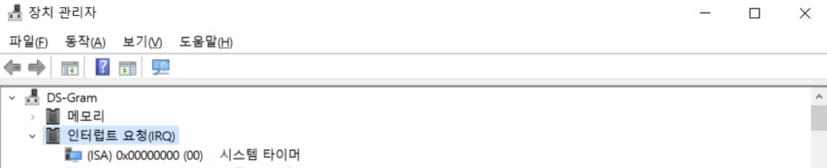

        

## 2. 동기(Synchronous) / 비동기(Asynchronous) 입/출력

동기/비동기 입/출력에 대해 살펴보겠습니다.

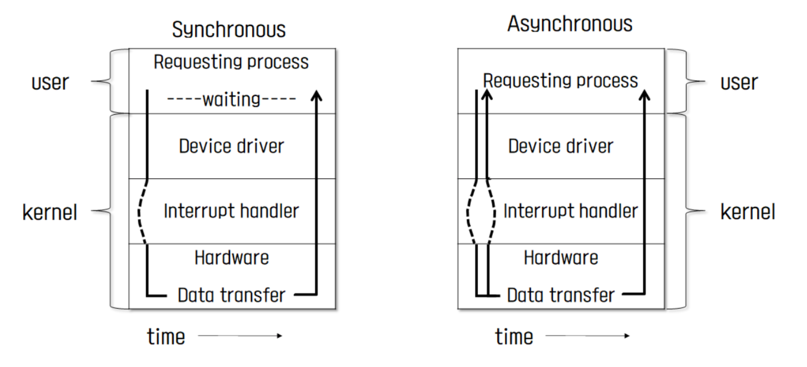

> 두 경우 모두 I/O의 완료는 I/O디바이스 컨트롤러가 인터럽트를 통해 알려줍니다.

        

### 2-1. 동기식 입출력(Synchronous I/O) 

I/O 작업이 끝난 후 이를 받아야 다음 작업을 할 수 있습니다. 따라서 I/O가 발생하는 동안 값을 기다립니다. I/O 요청 후 입출력 작업이 완료돼야 다음 작업을 할 수 있는데, I/O는 커널을 통해서만 일할 수 있으며 I/O의 완료는 I/O디바이스 컨트롤러가 인터럽트를 통해 알려준 후 제어가 사용자 프로그램에 넘어갑니다.

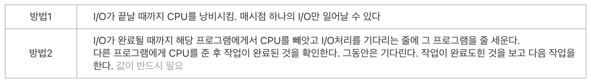

        

### 2-2. 비동기식 입출력(Asynchronous I/O)

I/O가 시작된 후 입출력 작업이 끝나기를 기다리지 않고 사용자 프로그램에 제어권이 즉시 넘어갑니다. 이때 `I/O의 컨트롤 디바이스`가 인터럽트를 걸어 작업의 완료를 알려줍니다. I/O 작업은 느리고 CPU는 연산 속도가 빨라 둘의 차이가 나기 때문에 CPU를 효율적으로 활용할 수 있게 됩니다. 예를 들어 writing의 경우 화면에 출력하라고 보낸 다음 별도의 작업을 할 필요 없으며, 프로그래머는 다음 작업을 할 수 있습니다.

        

## 3. DMA(Direct Memory Access)

CPU의 Interrupt Line이 호출을 많이 당하면 효율성이 떨어지기 때문에 DMA 컨트롤러를 추가로 두고 메모리에 접근할 수 있도록 하는 컨트롤러입니다. 이를 통해 작업해야 할 내용을 메모리에 올려두고 모든 세팅이 완료되면 CPU를 한 번만 호출합니다. 메모리에는 CPU, DMA Controller가 둘 다 접근할 수 있으며, 이 때문에 동시성 문제가 발생할 수 있어 `Memory Controller`가 이를 조율해 줍니다.

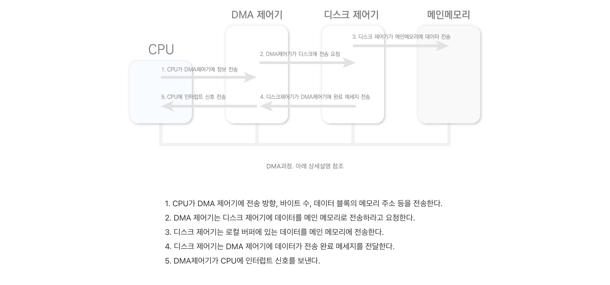

> DMA가 로컬버퍼 데이터를 복사합니다. 이는 메모리에 직접 접근이 가능하며, 블록, Page 등의 데이터가 일정량 쌓이면 CPU를 한 번 호출합니다.

        

DMA를 사용하지 않았을 경우 하나의 작업이 끝나면 Interrupt를 걸어 CPU를 호출합니다. 그렇게 되면 CPU는 현재 작업 중이던 문맥을 저장한 후 Interrupt가 걸린 작업을 우선 처리하고 다시 기존에 하던 작업을 하게 됩니다. 이런 과정이 반복해서 일어나면 효율적으로 CPU를 사용할 수 없습니다. 반면 DMA를 사용한다면 해당 작업을 Ready 상태로 CPU가 바로 작업할 수 있도록 메모리에 적재하며, 이를 통해 효율적으로 CPU를 사용할 수 있게 됩니다. 이때 `바이트(byte) 단위가 아닌 block 단위로 인터럽트가 발생`합니다. 이때 CPU의 중재 없이 Device Controller가 Device의 Buffer Storage의 내용을 메모리에 Block 단위로 직접 전송합니다.

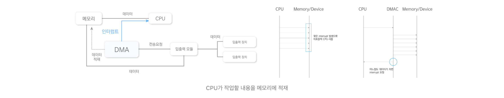

        

## 4. 서로 다른 입출력 명령어

인스트럭션에는 I/O 디바이스에 접근하는 인스트럭션(Speical Instruction)과 메모리에 접근하는 인스트럭션으로 메모리 접근하는 주소로 디바이스 주소로 접근할 수 있습니다. 아래 그림에서 오른쪽은 [Memory Mapped I/O](https://ko.wikipedia.org/wiki/%EB%A9%94%EB%AA%A8%EB%A6%AC_%EB%A7%B5_%EC%9E%85%EC%B6%9C%EB%A0%A5)로 I/O장치도 메모리주소의 연장선으로 봅니다. 반면 왼쪽은 I/O 작업 호출을 별도로 두고 오른쪽 메모리에다가 주소를 넣어 메모리에서 연장 호출을 합니다. 일반적으로는 메모리에 접근하는 주소와 디바이스 주소가 다릅니다. 

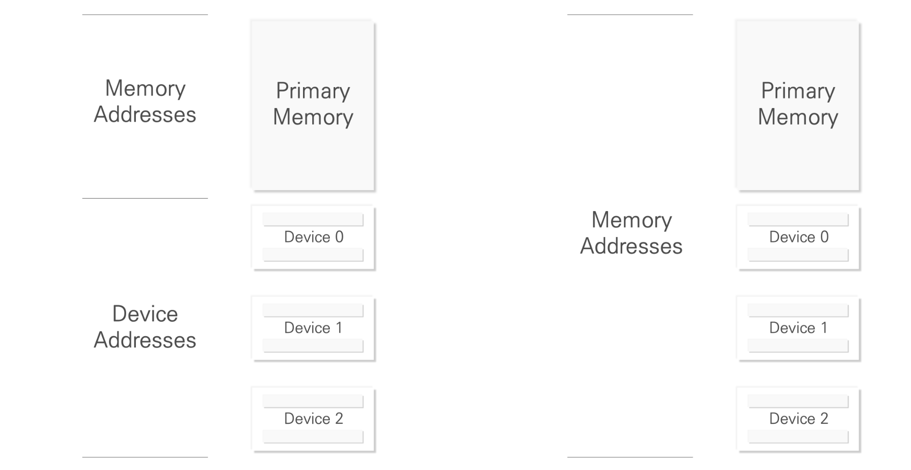

        

## 5. 저장 장치의 계층 구조

CPU가 직접 접근할 수 있는 메모리 스토리지 매체를 `Primary(Executable)`라고 하며 직접 접근하지 못하는 매체는 `Secondary`라고 부릅니다. Secondary에서 Primary로 갈수록 작업 처리 속도는 빨라지지만 그만큼 처리비용이 비싸며 한 번에 처리할 수 있는 데이터의 양이 적어지기 때문에 Secondary의 데이터를 한 번에 올리지 못합니다. 또한 CPU는 byte 단위로 접근할 수 있어야 하는데 하드디스크와 같은 세터 단위로 접근해야 하는 Secondary에는 접근할 수 없습니다.

 

캐시메모리는 Primary와 Secondary의 속도 차이를 완화하기 위한 중간계층으로 사용합니다. 캐시메모리 또한 용량이 한정되어 있으므로 기존에 있는 내용을 제거해야 하는데, 캐싱 알고리즘으로 이를 결정합니다. CPU는 1클럭 당 한 개의인 스트럭션을 처리하지만, D-RAM(Main Memory)은 10-100클럭이 걸리기 때문에 속도 차이를 완충하기 위해 캐시메모리, 레지스터와 같은 완충장치를 둡니다. 캐시메모리는 용량이 작기 때문에 당장 필요한 것들을 올려 작업합니다.

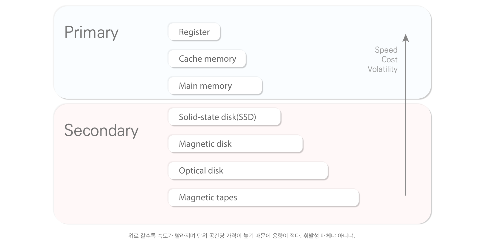

> Caching : coping information info faster storage system.
> Main memory(D-Ram), S-Ram(Cache Memory)등은 휘발성 메모리.

        

## 6. 프로그램의 실행

프로그램은 실행파일 형태로 하드디스크에 저장되어 있으며 이를 실행하는 순간 메모리에서 프로세스가 되어 프로그램이 실행됩니다. 프로그램을 실행시키면 주소공간이 형성되는데 이는 프로그램마다 독자적 공간을 가지며 Code, Data, Stack으로 구성되어 있습니다. 운영체제는 함수구조로 코드가 짜졌기 때문에 함수를 호출/리턴할때 스택 영역을 사용합니다. Code에는 실질적으로 수행할 코드가 담겨 있으며 Data에는 프로그램의 전역(Global) 변수와 정적(Static) 변수 등이 저장됩니다.

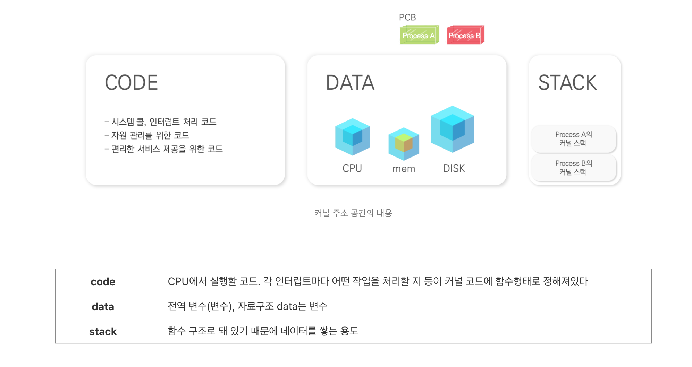

        

커널은 메인메모리에 항상 상주해 있지만, 사용자 프로그램은 사용자가 프로그램을 실행하는 순간 메인 메모리(Physical memory)에 올라옵니다. (파일 시스템 내부에 있는) 실행 파일이 실행되면 이는 메모리에 올라가서 프로세스가 되는데 이때 곧바로 메인메모리에 가지 않고 가상 메모리(Virtual memory)를 거쳐 메인 메모리로 올라가는 것입니다. 메인 메모리에 올라온 프로세스는 독자적 주소 공간(Address space)이 형성되며 이는 프로그램이 종료될 때 함께 사라집니다. 

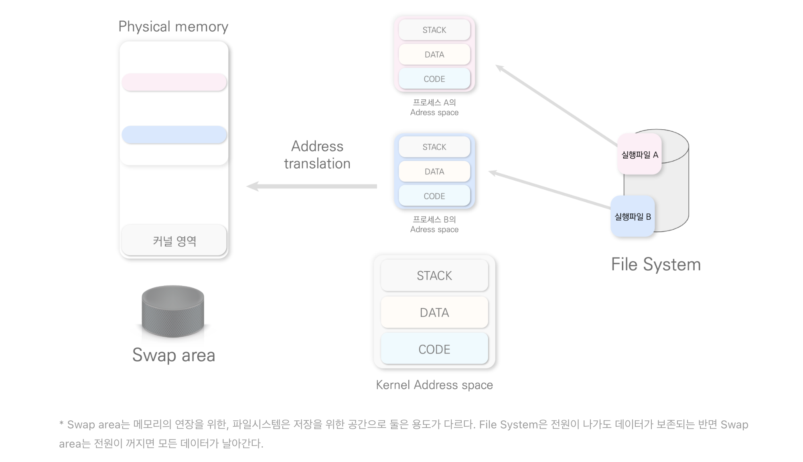

> 프로세스가 CPU와 작업을 할 때 프로그램의 공간을 효율적으로 사용하기 위해 주소 공간 전부를 메인 메모리에 올리지 않고 당장 CPU와 작업할 코드만 올린 후 나머지는 디스크의 Swap Area에 내려둡니다.

        

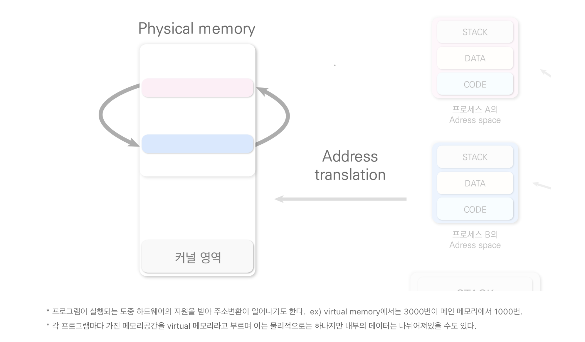

        

## 7. 사용자 프로그램이 사용하는 함수

CPU가 인스트럭션을 실행하는 도중 메모리의 주소를 바꿀 수도 있습니다. 이는 코드의 주소를 논리적으로 건너뛰어 실행하는 것으로 메인 메모리상에서는 가능하지만, 커널 코드로 이동하지는 못합니다. 커널의 함수를 호출하기 위해서는 인터럽트 라인을 세팅하고 시스템 콜을 통해 CPU 제어권이 운영체제로 넘어가게 만들어야 합니다.

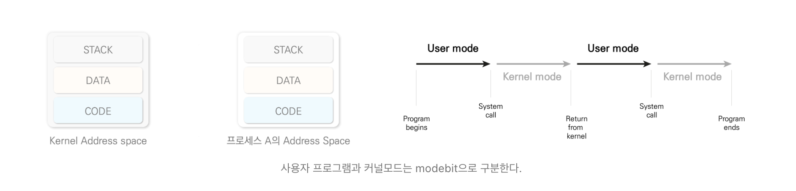

        

CPU가 메모리에 쌓인 스택 순서대로 인스트럭션을 수행하는 도중 다른 함수를 호출하면 메모리 주소를 점프할 수도 있습니다. 그런데 이것이 사용자 프로그램일 경우 I/O 작업을 요청하면서 운영체제의 함수를 호출하기 때문에 메모리 주소를 단순히 바꾸면 되는 것이 아닙니다. 프로그램이 인터럽트 라인을 걸면 CPU가 인터럽트 라인을 체크하고 CPU 제어권이 운영체제로 넘어가게 됩니다. 사용자 프로그램이 인터럽트 라인을 세팅하고 CPU 제어권이 운영체제에 넘어가고 작업을 할 수 있게 되는 것입니다.

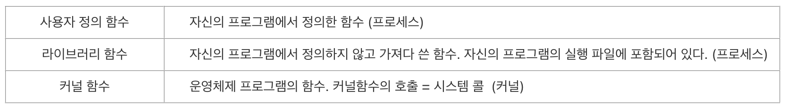

 
